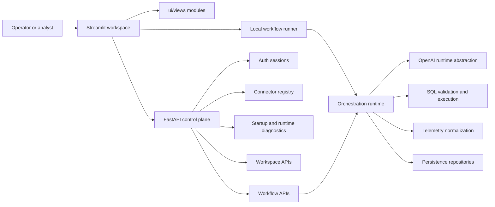
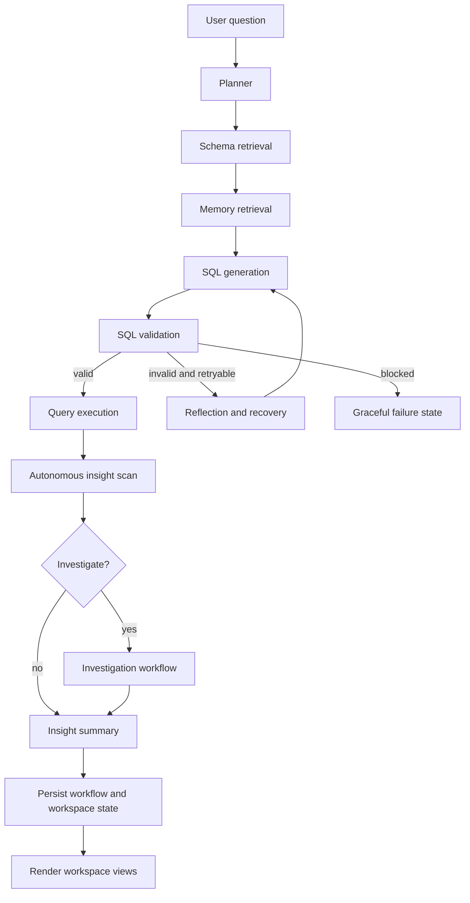
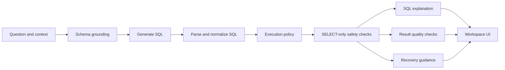
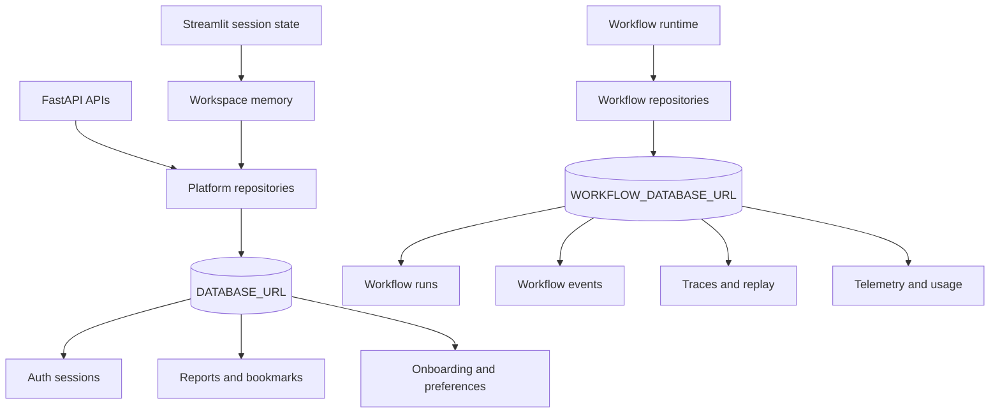
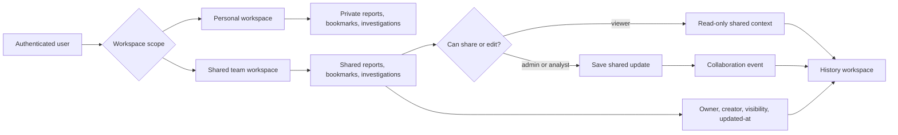
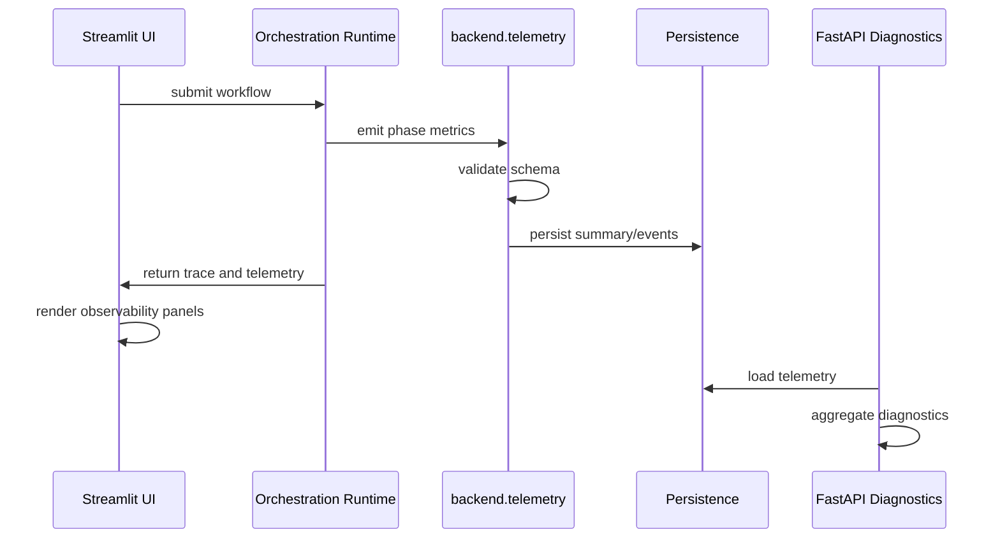
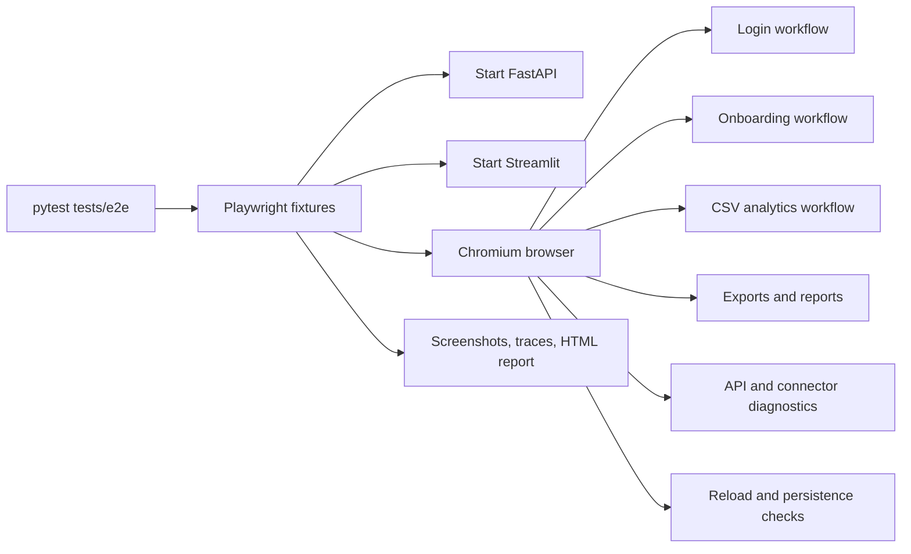

# Architecture Diagrams

This page collects the primary architecture diagrams for the Agentic AI Analytics Platform. The diagrams are written in Mermaid so they render directly in GitHub Markdown.

## Frontend And Backend Interaction

## Orchestration Workflow

## SQL Intelligence Lifecycle

## Persistence Architecture

## Collaboration Workspace Flow

## Telemetry Lifecycle

## E2E Testing Flow

